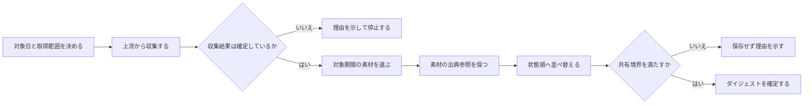
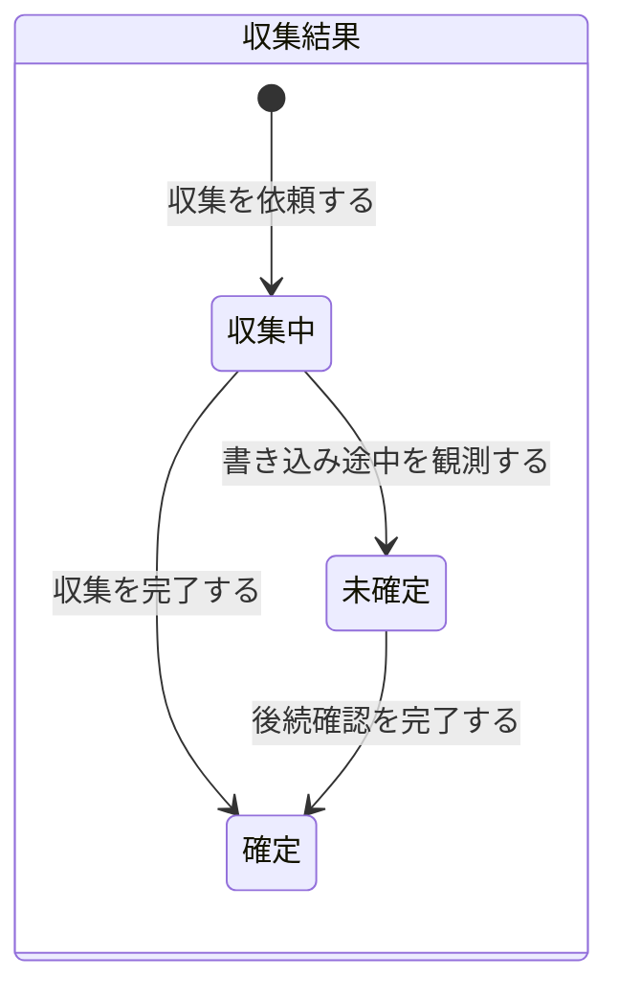
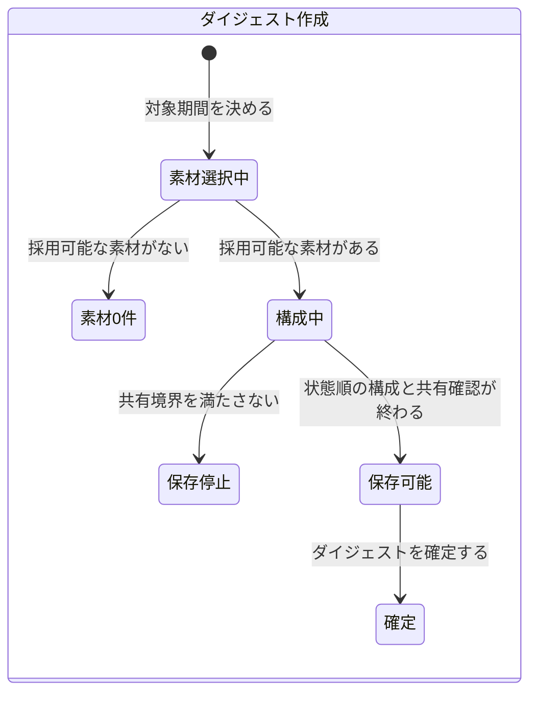

# 収集とダイジェスト作成 — 業務知識と振る舞い

## この資料の位置付け

この資料は、複数の上流情報から対象期間の素材を集め、読み手が現在の状態を追えるダイジェストへ変えるときの判断を定める正本である。

> コアは、対象期間の情報を、出典参照を失わず、読み手が追う状態順へ変える判断である。

個別サービスからの取得方法、設定解決、保存形式、コマンド、ファイル配置は実現手段であり、この資料の対象外とする。

## 根拠と確からしさ

次の既存資料で共通して観測できる規則を、確認済みの業務理解として扱う。

- [議事録収集の規則](../plugins/skills/collection/meeting-collect/SKILL.md) — 上流を正本とし、対象日を業務上の日付で選ぶ
- [議事録収集の進行](../plugins/skills/collection/meeting-collect/references/workflow.md) — 同じ上流項目の差分判定と収集物の更新を定める
- [Notionの日時判定](../plugins/skills/collection/meeting-collect/references/sources/notion.md) — 発生時刻を優先し、ない場合だけ作成時刻を使う
- [Google Docsの日時判定](../plugins/skills/collection/meeting-collect/references/sources/google-docs.md) — 発生時刻を優先し、ない場合だけ作成時刻を使う
- [Slack収集の規則](../plugins/skills/collection/slack-collect/SKILL.md) — 設定された取得範囲を黙って変えない
- [セッション収集の規則](../plugins/skills/collection/session-collect/SKILL.md) — 原文を複製しない索引と未確定状態を区別する
- [ダイジェスト作成の規則](../plugins/playbooks/collection/digest/skills/make-digest/SKILL.md) — 時系列素材を状態順へ並べ替える
- [素材と出典の規則](../plugins/playbooks/collection/digest/skills/make-digest/references/sourcing.md) — 各項目から元情報へ戻れるようにする
- [共有境界](../plugins/playbooks/collection/session-digest/references/privacy.md) — 共有成果物へ出してはならない情報を定める

## コアの境界

| 区分 | 対象 |
|---|---|
| コア | 対象期間と採用可能性の判断、出典参照の保持、異常を成功で覆わない判断、状態順への変換、共有可否の判断 |
| 支援 | 上流ごとの差分判定、取得範囲の解決、ダイジェスト作成へ素材を渡す工程 |
| 汎用 | 設定読込、形式検査、ファイル保存、ハッシュ計算 |

## ユビキタス言語

| 用語 | 意味 |
|---|---|
| 上流 | 議事録や発言など、内容の正本となる情報源 |
| 収集物 | 上流の写し、または原文を複製しない非公開索引。上流の代替正本ではない |
| 対象日 | 起動日ではなく、設定した時間帯へ換算した業務上の発生日または活動日 |
| ダイジェスト候補 | 対象期間に属し、採用可否を判断する前の情報 |
| 素材 | ダイジェスト候補のうち、採用条件を満たして選ばれた情報 |
| ダイジェスト | 素材を時系列の再話ではなく、決定・未決・行動などの状態順へ並べ替えた資料 |
| 未確定 | 書き込み途中などのため、対象期間の成果へ進めない収集結果 |
| 共有境界 | 非公開識別子や原文など、共有成果物へ出してよい情報の限界 |

## アクターと協働

| アクター | 目的 | 引き継ぐもの |
|---|---|---|
| 収集を依頼する利用者 | 指定した対象日の上流情報を、要約されていない収集物として得る | 対象日と明示設定 |
| ダイジェストを依頼する利用者 | 対象期間の決定・未決・行動を追える資料を得る | 対象期間と求める資料型 |
| ダイジェストを読む人 | 出典へ戻りながら現在の状態を確認する | 各項目と出典の対応 |

## 全体の流れ



## 状態と業務イベント





## 業務ルール

1. 収集物は上流の代替正本にしない。読み手が上流へ戻れる写し、または非公開参照として扱う。
2. 対象範囲は対象日と明示設定から決め、取得手段の都合で黙って拡張・縮小しない。
3. 素材0件では空のダイジェストを書かず、正常な変化なしとして報告する。取得不能、上限超過、未確定結果は成功で覆い隠さない。
4. ダイジェストは時系列を再話せず、決定・未決・行動など読み手が追う状態へ並べ替える。
5. 素材をダイジェスト項目へ採用するときは、既に持っている出典参照を失わない。
6. 共有境界を確認できないセッションダイジェストは保存しない。
7. 同じ上流項目の内容が変わっていなければ収集物を増やさず、変わっていれば同じ収集物を更新する。
8. 対象日は設定した時間帯の発生時刻から決める。発生時刻がない場合に限り、作成時刻を使う。

## 代表BDD

Feature: 出典へ戻れる素材を状態順のダイジェストへ変える

```gherkin
Scenario: 対象期間の素材を状態順のダイジェストにする
  Given 対象期間に採用可能な素材M1がある
  And 素材M1から出典へ戻れる
  And 収集結果は未確定ではない
  When 利用者が対象期間のダイジェスト作成を求める
  Then 素材M1は時系列ではなく状態順の項目になる
```

```gherkin
Scenario: 対象期間に素材がないときは空のダイジェストを作らない
  Given 素材置き場を確認できる
  And 対象期間に採用可能な素材が0件である
  When 利用者が対象期間のダイジェスト作成を求める
  Then 対象期間のダイジェストは作られない
  And ダイジェスト作成は正常に終了する
  And 素材0件であることが報告される
```

```gherkin
Scenario: 出典参照をダイジェスト項目へ引き継ぐ
  Given 素材M1は対象期間に属する
  And 素材M1から出典へ戻る参照がある
  When 素材M1がダイジェスト項目に採用される
  Then ダイジェスト項目には素材M1と同じ出典参照が残る
```

```gherkin
Scenario: 共有境界を満たさないセッションダイジェストは保存しない
  Given セッション収集結果は未確定ではない
  And 共有してはならない会話識別子が要約候補に含まれる
  When 共有用セッションダイジェストの保存前確認が始まる
  Then セッションダイジェストは保存されない
  And 共有可能とは判定されない
NOTE:
  Rule: 共有境界を確認できないセッションダイジェストは保存しない
  Reason: 共有成果物へ出してはならない情報が含まれるため
```

```gherkin
Scenario: 変更のない上流項目を重複して収集しない
  Given 上流項目U1の収集物が既にある
  And 上流項目U1の内容は前回収集時から変わっていない
  When 上流項目U1が再び収集対象になる
  Then 上流項目U1の収集物は増えない
  And 既存の収集物は変更なしになる
```

```gherkin
Scenario: 変更された上流項目の収集物を更新する
  Given 上流項目U1の収集物が既にある
  And 上流項目U1の新しい内容は既存の収集物と異なる
  When 上流項目U1が再び収集される
  Then 既存の収集物は新しい内容へ更新される
  And 上流項目U1の収集物は一件のまま保たれる
```

```gherkin
Scenario: 発生時刻を対象日の境界として使う
  Given 上流項目U1の発生時刻が設定した時間帯の午前0時である
  And 上流項目U1の発生時刻を確認できる
  When 上流項目U1の対象日を判定する
  Then 上流項目U1は午前0時が属する日を対象日とする
```

```gherkin
Scenario: 未確定のセッション収集結果から日次資料を作らない
  Given 対象日に活動したセッションがある
  And セッション収集結果が未確定である
  When 利用者が対象日のセッションダイジェスト作成を求める
  Then 対象日のセッションダイジェストは作られない
  And 収集結果が未確定であることが示される
NOTE:
  Rule: 未確定結果を成功した成果物で覆い隠さない
  Reason: 書き込み途中の情報を確定した日次資料として扱えないため
```

## 未回答の問い

- 収集とダイジェスト作成を横断した最終的な採用判断の責任者は、既存資料だけでは確認できない。資料所有者が回答責任者である。
- 上流ごとの取得失敗を、どの範囲まで一つのダイジェストで併存させるかは未確認である。

## この資料に書かないもの

- 外部サービスやAI製品の操作方法
- コマンド、スクリプト、設定ファイル、保存形式
- ファイル名、ディレクトリ構造、データベース、ハッシュ
- 個別取得元にだけ通用する再試行手順
